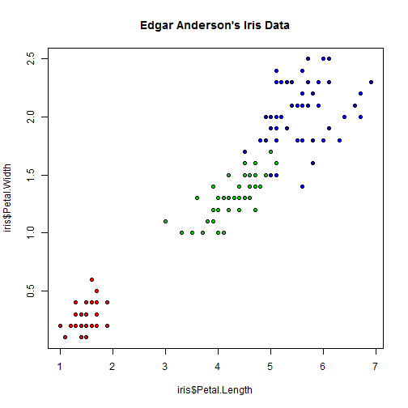

Iris Classification Application
========================================================
author: D.moody
date: 5/24/2015

Introduction
========================================================

<h3>Iris classification application using a LDA model and sample petal length and width.</h3>


The famous (Fisher's or Anderson's) iris data set gives the measurements in centimeters of the variables sepal length and width and petal length and width, respectively, for 50 flowers from each of 3 species of iris. The species are Iris setosa, versicolor, and virginica. By using a LDA model with this data I created a very simple application that takes Iris petal length and width and determine which of the three species the sample most likely came from.

Slide With Plot
========================================================

As you can see below the size of the three species petals group them nicely according to Species.

 

Model Selection
========================================================
Using a LDA model and the caret package I created a model and then ran a prediction on the model.


```r
library(caret)
library(e1071)
modlda <- train(Species ~ Petal.Width + Petal.Length, data = iris, method="lda")
```
In the application there are two slider bars that are used to select petal width and legth.
These two inputs are used to predict on the above mode.


Output
======

```r
confusionMatrix(modlda)
```

```
Bootstrapped (25 reps) Confusion Matrix 

(entries are percentages of table totals)
 
            Reference
Prediction   setosa versicolor virginica
  setosa       33.6        0.0       0.0
  versicolor    0.0       31.3       2.5
  virginica     0.0        1.7      30.9
```
The Accuracy rate was around 97%

Conclusion
===

I think you will find this application is simple to use and fairly accurate.

Thank you.
